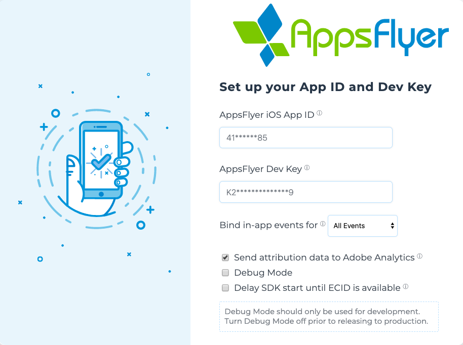

# In-App events

In-App Events provide insight on what is happening in your app. It is recommended to take the time and define the events you want to measure to allow you to measure ROI (Return on Investment) and LTV (Lifetime Value).

Find more info about recording events [here](https://support.appsflyer.com/hc/en-us/articles/115005544169-Rich-in-app-events-guide#introduction).
- [In-App events](#in-app-events)
  - [<a id="LogEvent"> Log Event](#a-idlogevent-log-event)

##  <a id="LogEvent"> Log Event
Adobe Launch AppsFlyer Extension is mapping and sending events reported using `MobileCore` to AppsFlyer in-app events.</br>
In the Adobe Launch AppsFlyer Extension you can choose the in-app event setting for your app:</br>

    
| Setting        | Description   |
| -------------- | ------------- |
| Action Events  | Only MobileCore.trackAction() will be sent to AppsFlyer                              | 
| State Events   | Only MobileCore.trackState() will be sent to AppsFlyer                               |
| All Events     | Both MobileCore.trackAction() and MobileCore.trackState() will be sent to AppsFlyer  |
| None           | No events will be sent |

For example, If you have `All Events` selected , then calling this API:
```swift
MobileCore.track(action: "testAnalyticsAction", data: ["revenue":"200","currency":"USD", "name":"AppsFlyer"])
```
will result in a testAnalyticsAction event tracked on the AppsFlyer Dashboard with a revenue of 200USD.

> revenue and currency parameters are mapped to `af_revenue` and `af_currency`.

**If you wish to send in-app events to AppsFlyer directly, please use our native SDK. Check out the documentation [here](https://dev.appsflyer.com/hc/docs/in-app-events-ios#the-logevent-method)** </br>

**Note:** An In-App Event name must be no longer than 45 characters. Events names with more than 45 characters do not appear in the dashboard, but only in the raw Data, Pull and Push APIs.
Find more info about recording events [here](https://dev.appsflyer.com/hc/docs/in-app-events-sdk).


